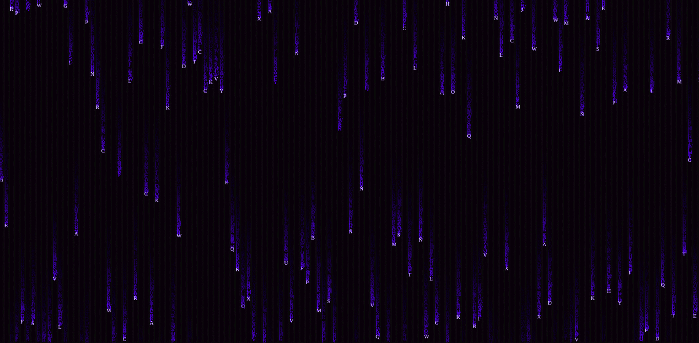

# Matrix effect made with JavaScript

## Installation

To install on your website is very simple:

> 1. Add the two canvas to your frontend code.

```html
<canvas id="matrix"></canvas> 
<canvas id="matrix2"></canvas>
```

> 2. Add the script to your html.

```html
<script src="https://matrixeffect.now.sh/src/bin/main.js"></script>
```

Now test and see if the matrix effect is running.

Gostou o projeto? Por favor considere <a href="https://github.com/hebertcisco/hebertcisco/blob/main/.github/patreon.md">ser um apoiador</a> e receba brindes exclusivos!


## Screenshot


